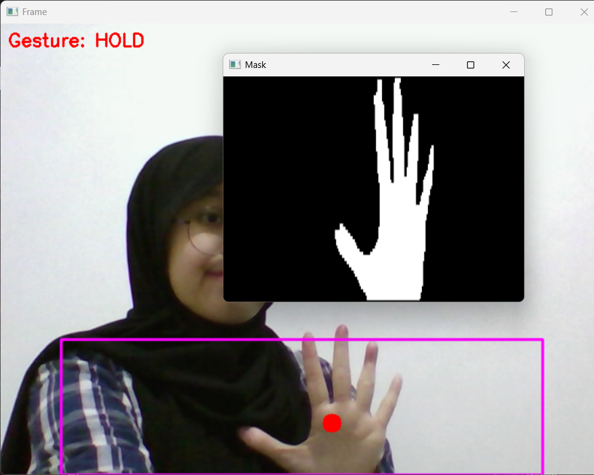
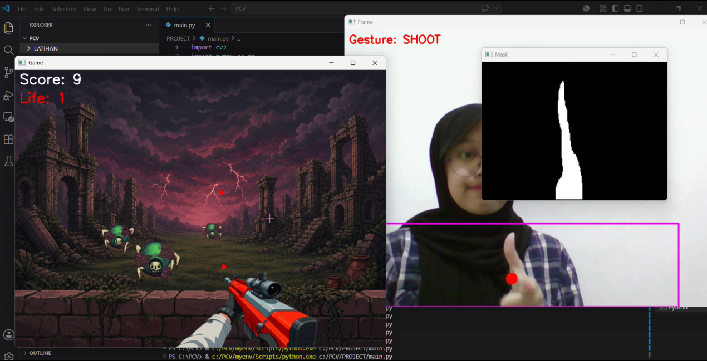

# DARK INVASION — Project Hand Weapon Mini Game
---
**Mata Kuliah:** Pengolahan Citra dan Video  
**Nama:** Athaya Khairani Adi  
**NRP:** 5024241007  

## Daftar Isi

1. [Deskripsi Game](#deskripsi-game)
2. [Fitur Game](#fitur-game)
3. [Tools yang Digunakan](#tools-yang-digunakan)
4. [Alur Program](#alur-program)
5. [Implementasi Teknis](#implementasi-teknis)
6. [Cara Menjalankan](#cara-menjalankan)
7. [Dokumentasi](#dokumentasi)
8. [Demo Video](#demo-video)
9. [Struktur Direktori](#struktur-direktori)
---

## Deskripsi Game

**Dark Invasion** adalah game tembak monster berbasis webcam di mana pemain mengendalikan senjata menggunakan gerakan tangan secara real-time. Posisi tangan digunakan untuk mengarahkan senjata ke kiri atau kanan, sedangkan pergerakan tangan dikenali sebagai perintah untuk menembakkan peluru.

Pada permainan ini, monster akan terus muncul dan bergerak menuju area pertahanan pemain. Pemain harus mengarahkan senjata dan menembak monster sebelum mereka berhasil mencapai garis pertahanan. Setiap monster yang berhasil dikalahkan akan menambah skor, sedangkan monster yang lolos akan mengurangi nyawa pemain. Monster bergerak dengan efek perspektif — mengecil saat jauh dan membesar saat mendekat — menciptakan ilusi kedalaman 3D tanpa engine game apapun.

## Fitur Game

| Fitur              | Deskripsi                                                               |
| ------------------ | ----------------------------------------------------------------------- |
| Gesture Detection  | Mendeteksi gerakan tangan untuk mengontrol aksi menembak.               |
| Weapon Control     | Senjata mengikuti posisi tangan secara real-time.                       |
| Second Object      | Monster sebagai target dan musuh dalam permainan.                       |
| Scoring System     | Skor bertambah setiap monster berhasil dikalahkan.                      |
| Health System      | Nyawa berkurang ketika monster mencapai area pertahanan.                |
| Weapon Overlay     | Senjata ditampilkan mengikuti posisi tangan menggunakan alpha blending. |
| Real-Time Gameplay | Seluruh proses permainan berjalan secara langsung melalui webcam.       |

### Kontrol Game

| Aksi            | Cara                                            |
| --------------- | ----------------------------------------------- |
| Mulai Game      | Tekan `SPACE`                                   |
| Arahkan Senjata | Gerakkan tangan ke kanan-kiri di area deteksi   |
| Menembak        | Pose menembak (adanya pergerakan tangan)        |
| Restart         | Tekan `R` saat Game Over                        |
| Keluar          | Tekan `ESC`                                     |

---

## Tools yang Digunakan

### Bahasa Pemrograman

- Python 3.14.4

### Library dan Modul

| Teknologi | Fungsi |
|----------|----------|
| OpenCV (`cv2`) | Akuisisi webcam, pengolahan citra, deteksi tangan, dan rendering game. |
| NumPy | Manipulasi array, operasi morfologi manual, dan perhitungan matematis. |
| os | Membaca direktori frame monster |
---

## Alur Program
1. **Webcam Capture**  
   Mengambil frame video secara real-time dari webcam.

2. **Flip Frame & Crop ROI**  
   Membalik frame secara horizontal agar pergerakan tangan sesuai dengan arah gerakan pemain, kemudian mengambil area deteksi tangan.

3. **HSV Conversion**  
   Mengubah ruang warna frame dari BGR ke HSV.

4. **Skin Color Masking**  
   Melakukan segmentasi warna kulit untuk memperoleh area kandidat tangan.

5. **Manual Morphology (Opening & Closing)**  
   Membersihkan noise dan memperbaiki hasil segmentasi menggunakan operasi morfologi.

6. **Hand Contour Detection**  
   Mencari kontur tangan dan menentukan posisi tangan yang terdeteksi.

7. **Gesture Recognition**  
   Menganalisis pergerakan tangan untuk mengenali aksi menembak.

8. **Weapon Position Update**  
   Memperbarui posisi senjata agar mengikuti posisi tangan secara real-time.

9. **Game Logic Update**  
   Memperbarui posisi monster, peluru, skor, dan nyawa pemain.

10. **Render Game Objects**  
    Menggambar background, senjata, monster, serta informasi permainan ke layar.

11. **Display Frame**  
    Menampilkan hasil akhir permainan secara real-time.

---

## Implementasi Teknis

### Segmentasi Warna Kulit

Deteksi tangan dilakukan menggunakan ruang warna HSV karena lebih stabil terhadap perubahan pencahayaan dibandingkan RGB. Frame webcam dikonversi ke HSV kemudian difilter menggunakan rentang warna kulit sehingga menghasilkan citra biner (*mask*).

```python
hsv = cv2.cvtColor(frame, cv2.COLOR_BGR2HSV)
mask = cv2.inRange(hsv, SKIN_LOWER, SKIN_UPPER)
```

Area berwarna putih pada mask dianggap sebagai tangan, sedangkan area hitam dianggap sebagai background.

---

### Operasi Morfologi Manual

Hasil segmentasi warna kulit sering kali masih mengandung noise atau lubang kecil pada objek tangan. Oleh karena itu, diterapkan operasi morfologi manual menggunakan NumPy.

```python
mask = erode(mask, kernel)
mask = dilate(mask, kernel)
```

Operasi **Opening (Erode → Dilate)** digunakan untuk menghilangkan noise kecil pada citra biner. Setelah itu, dilakukan **Closing (Dilate → Erode)** untuk menutup lubang yang masih terdapat pada area tangan sehingga bentuk objek menjadi lebih utuh dan mudah dideteksi.

---

### Deteksi Tangan

Setelah memperoleh mask yang bersih, sistem mencari kontur untuk menentukan lokasi tangan yang terdeteksi.

```python
contours, _ = cv2.findContours(
    mask,
    cv2.RETR_EXTERNAL,
    cv2.CHAIN_APPROX_SIMPLE
)
```

Kontur terbesar diasumsikan sebagai tangan dan digunakan untuk memperoleh koordinat posisi yang akan mengendalikan senjata di dalam permainan.

---

### Gesture Recognition

Aksi menembak ditentukan berdasarkan perubahan posisi tangan antar frame. Sistem membandingkan posisi tangan saat ini dengan posisi pada frame sebelumnya untuk menghitung besar pergerakan.

```python
speed = abs(cy - prev_cy)

if speed > SHOOT_THRESHOLD:
    shoot()
```

Apabila perpindahan posisi melebihi nilai ambang yang ditentukan, sistem akan menganggap pemain melakukan gesture menembak (*SHOOT*) dan peluru akan dibuat.

---

### Weapon Overlay

Sprite senjata ditempelkan ke frame permainan menggunakan teknik **alpha blending manual** sehingga dapat menyatu dengan background tanpa menghilangkan transparansi gambar.

```python
result = alpha * weapon +
         (1 - alpha) * background
```

Posisi senjata diperbarui pada setiap frame agar selalu mengikuti posisi tangan yang terdeteksi secara real-time.

---

### Second Object (Monster)

Monster berfungsi sebagai target utama dalam permainan. Setiap monster memiliki posisi dan kecepatan yang diperbarui secara terus-menerus selama permainan berlangsung.

```python
monster.z += monster.speed
```

Selain bergerak mendekati pemain, ukuran monster juga berubah berdasarkan jarak sehingga menghasilkan efek perspektif

---

### Scoring System

Sistem skor digunakan untuk memberikan poin kepada pemain setiap kali monster berhasil dikalahkan.

```python
if bullet_hit_monster:
    score += 10
```

Semakin banyak monster yang berhasil ditembak, semakin tinggi skor yang diperoleh pemain.

---

### Rendering

Seluruh elemen permainan seperti background, senjata, monster, skor, dan nyawa digabungkan ke dalam satu frame sebelum ditampilkan ke layar.

```python
cv2.imshow("Dark Invasion", frame)
```

Proses rendering dilakukan secara terus-menerus sehingga permainan dapat berjalan secara real-time dengan respons yang langsung terhadap gerakan pemain.


## Cara Menjalankan

### 1. Install Dependency

```bash
pip install opencv-python numpy
```

### 2. Siapkan Aset Monster

Jalankan file `convert_gif.py` satu kali untuk mengonversi animasi monster (.gif) menjadi kumpulan frame PNG yang digunakan oleh game.

> Langkah ini hanya diperlukan saat menyiapkan aset dan tidak perlu dilakukan setiap kali menjalankan game.

### 3. Jalankan Program

```bash
python main.py
```

### 4. Tips Penggunaan

* Gunakan pencahayaan yang cukup.
* Pastikan tangan berada di area deteksi.
* Gunakan latar belakang yang kontras dengan warna kulit.
* Pastikan webcam dapat menangkap tangan dengan jelas.

---

## Dokumentasi
### Menu Utama

Tampilan awal permainan sebelum game dimulai. Pemain dapat menekan tombol **SPACE** untuk memulai permainan.

<p align="center">
  
</p>

### Skin Masking

Hasil segmentasi warna kulit pada ruang warna HSV setelah melalui proses morfologi. Area putih menunjukkan bagian tangan yang berhasil terdeteksi.

<p align="center">
  
</p>

### Hand Gesture Detection

Proses deteksi tangan yang digunakan untuk mengontrol senjata dan mengenali gesture menembak berdasarkan pergerakan tangan.

<p align="center">
  
</p>

### Gameplay

Tampilan utama saat permainan berlangsung. Senjata mengikuti posisi tangan pemain dan monster akan muncul secara terus-menerus sebagai target.

<p align="center">
  
</p>

### Game Over

Tampilan akhir permainan ketika nyawa pemain habis. Skor akhir akan ditampilkan dan pemain dapat mengulang permainan dengan menekan tombol **R**.

<p align="center">
  
</p>

## Demo Video

Berikut link video demonstrasi : 
🔗 [Video Demonstrasi Dark Invasion](https://youtu.be/HLevUzgWXjU)

---

## Struktur Direktori

```text
dark-invasion/
├── main.py
├── convert_gif.py
├── README.md
├── assets/
│   ├── backgroundgame.png
│   ├── weapon.png
│   ├── monster.gif
│   └── monster_frames/
│       ├── frame_000.png
│       ├── frame_001.png
│       └── ...
└── documentation/
    ├── menu.png
    ├── hand gesture.png
    ├── mask.png
    ├── play.png
    └── gameover.png
```
