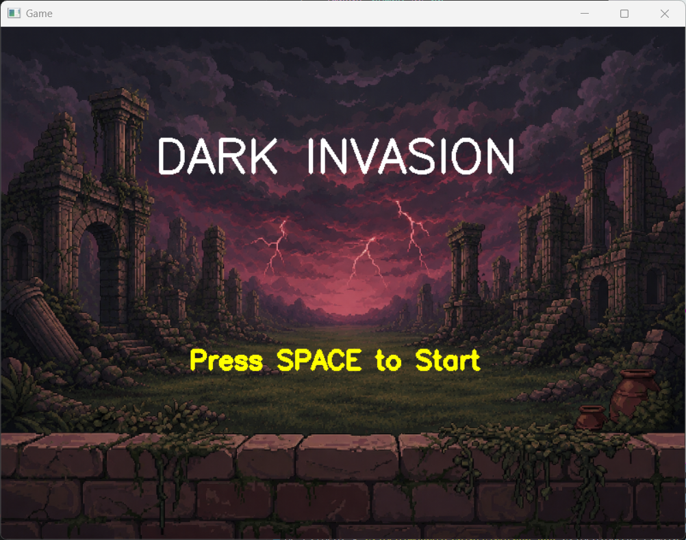

# DARK INVASION — Project Hand Weapon Mini Game
---
**Nama:** Athaya Khairani Adi  
**NRP:** 5024241007  
**Mata Kuliah:** Pengolahan Citra Video
---

## Daftar Isi

1. [Deskripsi Game](#-deskripsi-game)
2. [Fitur Game](#-fitur-game)
3. [Teknologi yang Digunakan](#-teknologi-yang-digunakan)
4. [Alur Program](#-alur-program)
5. [Implementasi Teknis](#-implementasi-teknis)
6. [Cara Menjalankan](#-cara-menjalankan)
7. [Dokumentasi](#-dokumentasi)
8. [Demo Video](#-demo-video)
9. [Struktur Direktori](#-struktur-direktori)

---

## Deskripsi Game

**Dark Invasion** adalah game tembak monster berbasis webcam di mana pemain mengendalikan senjata menggunakan gerakan tangan secara real-time. Posisi tangan digunakan untuk mengarahkan senjata ke kiri atau kanan, sedangkan pergerakan tangan dikenali sebagai perintah untuk menembakkan peluru.

Pada permainan ini, monster akan terus muncul dan bergerak menuju area pertahanan pemain. Pemain harus mengarahkan senjata dan menembak monster sebelum mereka berhasil mencapai garis pertahanan. Setiap monster yang berhasil dikalahkan akan menambah skor, sedangkan monster yang lolos akan mengurangi nyawa pemain. Monster bergerak dengan efek perspektif — mengecil saat jauh dan membesar saat mendekat — menciptakan ilusi kedalaman 3D tanpa engine game apapun.

Game ini menerapkan beberapa konsep utama, yaitu:

- **Segmentasi warna kulit berbasis HSV** untuk mengisolasi area tangan dari latar belakang.
- **Operasi morfologi manual (Opening dan Closing)** menggunakan NumPy untuk menghilangkan noise dan memperbaiki hasil segmentasi.
- **Analisis kontur** untuk menentukan posisi serta pergerakan tangan yang terdeteksi.
- **Gesture Recognition** berbasis perubahan posisi tangan antar frame untuk mendeteksi aksi menembak (*SHOOT*).
- **Alpha Blending Manual** untuk menempatkan sprite senjata agar dapat mengikuti posisi tangan secara real-time.
- **Sistem skor (Scoring System)** yang memberikan poin setiap kali monster berhasil dikalahkan.
- **Interaksi dengan objek permainan (Second Object)** berupa monster yang berfungsi sebagai target sekaligus musuh dalam permainan.
---

## Fitur Game

| Fitur              | Deskripsi                                                               |
| ------------------ | ----------------------------------------------------------------------- |
| Gesture Detection  | Mendeteksi gerakan tangan untuk mengontrol aksi menembak.               |
| Weapon Control     | Senjata mengikuti posisi tangan secara real-time.                       |
| Second Object      | Monster sebagai target dan musuh dalam permainan.                       |
| Scoring System     | Skor bertambah setiap monster berhasil dikalahkan.                      |
| Health System      | Nyawa berkurang ketika monster mencapai area pertahanan.                |
| Weapon Overlay     | Senjata ditampilkan mengikuti posisi tangan menggunakan alpha blending. |
| Real-Time Gameplay | Seluruh proses permainan berjalan secara langsung melalui webcam.       |

### Kontrol Game

| Aksi            | Cara                                            |
| --------------- | ----------------------------------------------- |
| Mulai Game      | Tekan `SPACE`                                   |
| Arahkan Senjata | Gerakkan tangan ke kanan-kiri di area deteksi   |
| Menembak        | Pose menembak (adanya pergerakan tangan)        |
| Restart         | Tekan `R` saat Game Over                        |
| Keluar          | Tekan `ESC`                                     |

---

## Tools yang Digunakan

### Bahasa Pemrograman

- Python 3.14.5

### Library dan Modul

| Teknologi | Fungsi |
|----------|----------|
| OpenCV (`cv2`) | Akuisisi webcam, pengolahan citra, deteksi tangan, dan rendering game. |
| NumPy | Manipulasi array, operasi morfologi manual, dan perhitungan matematis. |
| os | Membaca direktori frame monster |
---

## Alur Program

1. **Webcam Capture**
   Mengambil frame video secara real-time dari webcam.

2. **Flip Frame & Crop ROI**
   Membalik frame secara horizontal agar pergerakan tangan sesuai dengan arah gerakan pemain dan mengambil area deteksi tangan.

3. **HSV Conversion**
   Mengubah ruang warna frame dari BGR ke HSV.

4. **Skin Color Masking**
   Melakukan segmentasi warna kulit untuk memperoleh area kandidat tangan.

5. **Manual Morphology (Opening & Closing)**
   Membersihkan noise dan memperbaiki hasil segmentasi.

6. **Hand Contour Detection**
   Mencari kontur tangan dan menentukan posisi tangan yang terdeteksi.

7. **Gesture Recognition**
   Menganalisis pergerakan tangan untuk mengenali aksi menembak.

8. **Weapon Position Update**
   Memperbarui posisi senjata agar mengikuti posisi tangan.

9. **Game Logic Update**
   Memperbarui posisi peluru, monster, skor, dan nyawa pemain.

10. **Render Game Objects**
    Menggambar seluruh objek permainan ke layar.

11. **Display Frame**
    Menampilkan hasil akhir permainan secara real-time.

---

## Implementasi Teknis

| Komponen            | Deskripsi                                                                    |
| ------------------- | ---------------------------------------------------------------------------- |
| Akuisisi Video      | Membaca frame webcam secara real-time menggunakan OpenCV.                    |
| Segmentasi HSV      | Mendeteksi area tangan berdasarkan warna kulit pada ruang warna HSV.         |
| Morfologi Manual    | Membersihkan mask menggunakan Opening dan Closing berbasis NumPy.            |
| Deteksi Tangan      | Menentukan posisi tangan dari kontur yang terdeteksi.                        |
| Weapon Overlay      | Menampilkan senjata yang mengikuti posisi tangan menggunakan alpha blending. |
| Gesture Recognition | Mengenali gerakan menembak berdasarkan perubahan posisi tangan.              |
| Second Object       | Monster sebagai target yang harus dikalahkan pemain.                         |
| Scoring System      | Menambahkan skor saat monster berhasil ditembak.                             |
| Health System       | Mengurangi nyawa pemain ketika monster mencapai area pertahanan.             |
| Rendering           | Menampilkan seluruh elemen permainan secara real-time.                       |

---

##  Cara Menjalankan

### 1. Install Dependency

```bash
pip install opencv-python numpy
```

### 2. Siapkan Aset Monster

Jalankan file `convert_gif.py` satu kali untuk mengonversi animasi monster (.gif) menjadi kumpulan frame PNG yang digunakan oleh game.

> Langkah ini hanya diperlukan saat menyiapkan aset dan tidak perlu dilakukan setiap kali menjalankan game.

### 3. Jalankan Program

```bash
python main.py
```

### 4. Tips Penggunaan

* Gunakan pencahayaan yang cukup.
* Pastikan tangan berada di area deteksi.
* Gunakan latar belakang yang kontras dengan warna kulit.
* Pastikan webcam dapat menangkap tangan dengan jelas.

---

## Dokumentasi

| Menu Utama                  | Gameplay                        | Game Over                       |
| --------------------------- | ------------------------------- | ------------------------------- |
|  |  |  |

---

## Demo Video

Berikut link video demonstrasi : 
🔗 [Video Demonstrasi Dark Invasion](LINK_VIDEO_YOUTUBE)

---

## Struktur Direktori

```text
dark-invasion/
├── main.py
├── convert_gif.py
├── README.md
├── assets/
│   ├── backgroundgame.png
│   ├── weapon.png
│   ├── monster.gif
│   └── monster_frames/
│       ├── frame_000.png
│       ├── frame_001.png
│       └── ...
└── documentation/
    ├── menu.png
    ├── gameplay.png
    └── gameover.png
```
